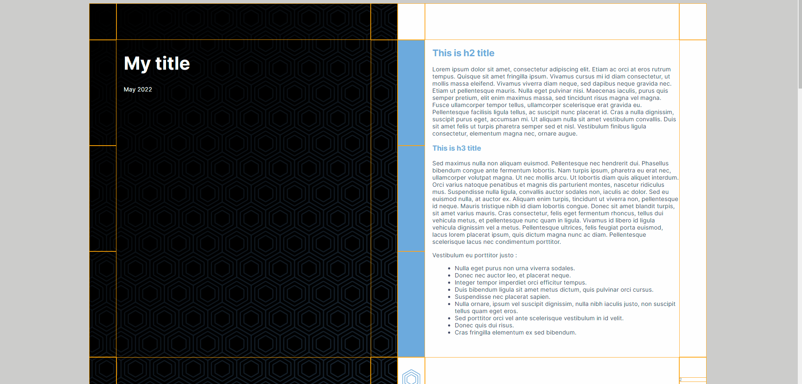
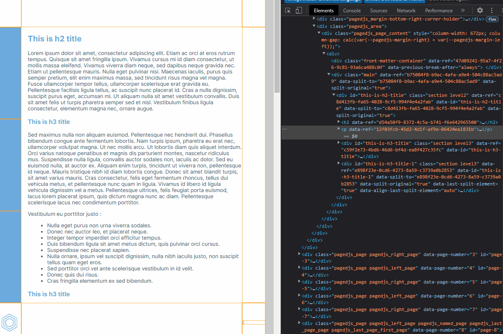

```{r setup, include=FALSE}
knitr::opts_chunk$set(echo = FALSE, 
                      warning = FALSE,
                      message = FALSE,
                      rows.print = 5)
```

```{r}
library(tidyverse)
```


class: inverse, center, middle

background-image:url("img/page.jpg")

# Introduction to pagedown

---

## The problem

We often want to get PDF from R :

--

+ it's portable

--

+ it's widely used in the business world

--

+ it allows parametrised reporting

---

## The problem


... And we sometimes use LaTeX for that task, but :

--

+ outputs are awful (outside from the scientific world)

```{r, out.height='250px', fig.align = 'left'}
knitr::include_graphics("https://i.stack.imgur.com/Nug7W.png", dpi = 300)
```

--

+ they are hard to customize

---

## The solution : `pagedown`

Principles :

--

+ it relies on PagedJs, a Javascript library

--

+ this one helps to "translate" some CSS style into a page

--

+ and you can print this page (using Chrome or another browser, in R : `pagedown::chrome_print`) to get a PDF

---

## Why `pagedown` ?

**It's a web-based tool**

--

So you can use tools like HTML, CSS or Javascript to style it :

--

+ way easier than LaTeX to learn

--

+ easier to reuse or share some parts with your website or other templates (like `xaringan` or `blogdown`)

--

+ outputs are nicer than with LaTeX

---

## Some examples

```{r, out.height='300px', fig.align='default', fig.show = "hold"}
knitr::include_graphics(
  c(
    "https://raw.githubusercontent.com/tvroylandt/sgdf_pagedown/master/img/page1.PNG",
    "https://p218.p3.n0.cdn.getcloudapp.com/items/4gumRNLp/Image%202020-03-22%20at%202.24.38%20PM.png",
    "https://mk0rfortheresto0o08q.kinstacdn.com/wp-content/uploads/2021/01/grid.gif"
  ),
  dpi = 300
)
```

---

## Some examples

```{r, fig.align='left', out.height='200px', out.width='400px'}
knitr::include_graphics("img/psc_housing_1.png", dpi = 300)
knitr::include_graphics("img/psc_housing_2.png", dpi = 300)
```

---
class: inverse, center, middle

background-image:url("img/anatomy.jpg")

# Anatomy of a document

---

## How `pagedown` works

--

**`pagedown`** is a R package which provide custom outputs formats :

--

+ you call it through `pagedown::html_paged` in the YAML header

--

+ and use the `css` argument to provide a custom style sheet

--

```{yaml, echo = TRUE, eval = FALSE}
---
title: "My title"
date: "May 2022"
output:
  pagedown::html_paged:
    css: "assets/main.css"
    number_sections: FALSE
knit: pagedown::chrome_print
---
```

--

+ **tip** : you can also wrap it inside a custom package and a custom function

---

## Behind the scene

--

1. `pagedown` + `rmarkdown` translate the document into a web page build with **HTML** (using Pandoc)

--

2. `pagedown` calls PagedJs :

  + which cuts the document into pages (like scissors)
  + put everything at the right place (like glue on papper) by looking at the `@page` statement in the **CSS**

--

3. We use `pagedown::chrome_print` to print the document to PDF using Chrome printing device

--

```{r, fig.align='left', out.height='300px', out.width='900px'}
knitr::include_graphics("img/pagedown_process.png", dpi = 300)
```

---
class: inverse, center, middle

background-image:url("img/markup.jpg")

# HTML : a markup tool

---

## HTML : a definition

HTML means HyperText Markup Language : 

--

+ You can see it as a building block of every Web Page, like a Lego brick.

--

+ A lot of bricks are available :

  + `<p>` for paragraphs
  + `<h1>`, `<h2>` and so on for titles
  + `<ul>` and `<li>` for lists
  + etc.
  
--

+ They are often nested
  
--

+ The user can define it's own bricks called "div" using `<div>` and `</div>` (to begin/close the block)

---

## How to get the HTML skeleton of a web page

You can show the HTML content of your document by opening it in Chrome and use the DevTools (Inspect). It shows you the differents divs.

```{r, out.height='400px'}

```

---

## How does it look like ?

```{r, out.height='500px'}

```

---

## HTML as an R user

+ You don't write plain HTML, you write Markdown

--

+ Behind the scenes, `rmarkdown` calls Pandoc, which translate it into HTML--

--

+ You can define special divs using `:::name-of-the-div` to open it and `:::` to close it

--

+ See [the guide](https://www.markdownguide.org/basic-syntax/) for the translation between Markdown and HTML

---

## Common HTML elements

```{r tbl_html}
tibble(
  elem = c(
    "p",
    "h1",
    "h2",
    "h3",
    "ul",
    "li",
    "blockquote",
    "img",
    "toc",
    "body"
  ),
  meaning = c(
    "Paragraph",
    "Header 1",
    "Header 2",
    "Header 3",
    "List",
    "List element",
    "Blockquote",
    "Image",
    "Table of contents",
    "Body (everything)"
  )
) %>% 
  knitr::kable("html", col.names = c("Element", "Meaning"))
```

---

class: inverse, center, middle

background-image:url("img/drawing.jpg")

# CSS : draw the world

---

## CSS : a definition

CSS means Cascading Style Sheets :

--

+ it's used to describe how elements should look like

--

+ if HTML is the Lego brick, CSS is the description of it :

  + size
  + color
  + shape
  
--

```{r, fig.align='left', out.height='200px', out.width='600px'}
knitr::include_graphics("img/lego_html_css.png", dpi = 300)
```

---
## CSS properties

A CSS file is a list of properties for each HTML element :

```{css, eval = FALSE, echo = TRUE}
h1 {
  font-size: 36pt;
  color: #6caadd;
  margin-left: 0.2in;
}

h2 {
  font-size: 18pt;
  color: #6caadd;
  margin-left: 0.2in;
}

p, ul, li {
  font-size: 12pt;
  color: #404e6b;
  margin-left: 0.2in;
}

blockquote {
  border-left: 2px solid blue;
}
```

---
## In R

--

The main way to use CSS is to provide a link to a CSS file inside the `css` argument of your custom format :

```{r, fig.align='left', out.height='200px', out.width='600px'}
knitr::include_graphics("img/pagedown_help_css.png", dpi = 300)
```

--

It will replace the default style provided with the package.

--

The special divs made in RMarkdown could be access by `.name-of-the-div{}`

---

## Common CSS properties

```{r tbl_css1}
tibble(
  prop = c(
    "font-size",
    "font-family",
    "font-weight",
    "font-style",
    "color",
    "background-color",
    "background-image",
    "background-repeat",
    "line-height"
  ),
  meaning = c(
    "Font size (mostly in pt)",
    "Font family",
    "Font weight (normal, bold, or a weight from 100 to 900)",
    "Font style, like italic",
    "Color of the element",
    "Color of the background",
    "Url of the background image",
    "Always to no-repeat",
    "Line height"
  ),
  example = c(
    "font-size: 36pt;",
    "font-family: Inter;",
    "font-weight: bold;",
    "font-style: italic;",
    "color: #6caadd;",
    "background-color: #6caadd;",
    "background-image: url(img/my_img.jpg);",
    "background-repeat: no-repeat;",
    "line-height: 1;"
  )
) %>%
  knitr::kable("html", col.names = c("Element", "Meaning", "Example"))
```

---

## Common CSS properties

```{r tbl_css2}
tibble(
  prop = c(
    "margin-block-start",
    "margin-block-end",
    "content",
    "margin",
    "padding",
    "border"
  ),
  meaning = c(
    "Margin before the block",
    "Margin after the block",
    "Text content if needed",
    "Margin",
    "Padding (margins but less with less constraints)",
    "Border (if you want solid border)"
  ),
  example = c(
    "margin-block-start: 2px;",
    "margin-block-end: 2px;",
    "content: 'my content';",
    "margin : 1in;",
    "padding; 0.5in;",
    "border:2px solid #6caadd;"
  )
) %>%
  knitr::kable("html", col.names = c("Element", "Meaning", "Example"))
```

---

class: inverse, center, middle

background-image:url("img/beast.jpg")

# Inside of the beast

---

## An opiniated opinion

At R for the Rest of Us, we developed a framework based on :

--

+ the use of lightweight CSS files as modules instead of the standard files provided with the package. Each file assume a part of the global design

--

+ CSS variables to propagate values througout the style sheets and avoid repetitions

--

+ methods to pass values of R objects to the CSS

---

## Modules

--

We only put one file into the `css` argument of the `html_paged()` function : `assets.css` :

```{css, eval = FALSE, echo = TRUE}
/* modules */
@import "modules/vars.css";
@import "modules/fonts.css";
@import "modules/body.css";
@import "modules/pictures.css";
@import "modules/title.css";
@import "modules/last.css";
@import 'modules/layout.css';

/* interface */
@import "interface/interface.css";
```

--

+ it calls the others files with `@import`

+ they are divided between modules and interface. The latest only helps to develop the template.

---

## CSS variables

In `vars.css`, we define CSS variables :

--

+ inside of a `:root{}` statement
+ you can define variable using `--variable-name: value;`

--

```{css, eval = FALSE, echo = TRUE}
:root {
  /* fonts */
  --font-main: "Inter";
  --font-title: "Inter";

  /* colors */
  --text-color: #404e6b;
  --rru-lightblue: #6caadd;
}
```

--

+ after that, they could be used in the CSS like :

```{css, eval = FALSE, echo = TRUE}
h3 {
  color: var(--rru-lightblue);
  font-family: var(--font-title);
}
```

---

## CSS variables

+ they help to be consistent across the document

+ they are also useful when you need to adjust one value in the whole style

+ you can use them mostly for position (margins), size, colors

+ they are also a way to get a value from R

---

## Get a value from R to the style

Sometimes, you want to change things in the style depending on an R object :

+ change the name in the footer to match with the parameter of the report (like a town name as an example)
+ change an image (like an inset map) for the same reason

One way to do it is to generate a CSS variable from R and put it inside the CSS like in the following render function :

```{r, eval = FALSE, echo= TRUE}
print_rru <- function(name) {
  # write CSS to temp -> this doesn't work in the Rmd with knit
  temp_path <- tempfile(fileext = ".css")
  writeLines(paste0(":root {--name: '", name, "';}"), con = temp_path)
  
  # to html
  rmarkdown::render(
    "report.Rmd",
    output_format = pagedown::html_paged(
      css = c("assets/main.css", temp_path),
      number_sections = FALSE
    ),
    params = list(name = name)
  )
}
```

---

## Get a value from R to the style

Then you can call the CSS variable in the CSS like :

```{css, eval = FALSE, echo= TRUE}
content: var(--name)"'s Report";
```

--

Other options are available :

--

+ Javascript inside the Pandoc template, see [`pagedreport`](https://github.com/rfortherestofus/pagedreport/blob/main/inst/resources/html/template_paged.html#L183) for an example 

--

+ `front_cover` and `back_cover` arguments to change the front/back image ->  [Documentation](https://pagedown.rbind.io/#covers)

---

## Tip : make a two-column layout

Sometimes, you need to put elements side by side. It's often the case when you create a parametrised report where you want to put text and graphs together.

--

In this case, you have to create two things, one in the RMarkdown :

```{md, eval = FALSE, echo= TRUE}
:::wrap-columns
:::columns-50
Some content here
:::
::: columns-50
Some content here
:::
:::
```

--

And one in the CSS :

```{css, eval = FALSE, echo= TRUE}
.wrap-columns {
  display: flex;
  padding: 0 0pt;
}

.columns-50 {flex: 50%;}
```

---

## Tip : make a two-column layout

This create two levels of blocks where your content will be put :

```{r, fig.align='left', out.height='300px', out.width='600px'}
knitr::include_graphics("img/two_columns.png", dpi = 300)
```

--

You can also adjust the size of columns inside the CSS or create more than two if needed.

---

class: inverse, center, middle

background-image:url("img/library.jpg")

# Files review

---
## Body

In `body.css`, we enable all "normal elements" :

+ text with `p`
+ lists with `ul` and `li` (or `ol` for numbered lists)
+ headers with `h1` -> `h6`
+ blockquotes
+ links with `a`

This part could be share with other Rmd templates of your compagny since it's not `pagedown` specific.

---
## Fonts

`fonts.css` helps to import fonts because:

+ either the font you call is installed on your system 
+ either it isn't (and you should assume it isn't if the document is shared) and you must import it (mostly from Google Fonts or elsewhere on the web) as in the examples below :

```{css, eval = FALSE, echo= TRUE}
@import 'https://fonts.googleapis.com/css2?family=DM+Sans:ital,wght@0,400;0,700;1,400&display=swap';
```

```{css, eval = FALSE, echo= TRUE}
@import url("https://rsms.me/inter/inter.css");

html {
    font-family: "Inter", sans-serif;
  }
```

---
## Pictures

Pictures (in `pictures.css`) are important since every R graph output is an image.

In the CSS, we set a limit to the size of the images, so it doesn't get out of the page :

```{css, eval = FALSE, echo= TRUE}
img {
  max-width: 100%;
}
```

You can reduce the parameter if you want smaller images/graphs.

--

If you want to handle graph size, you can also use in code chunks :

+ `fig.height` and `fig.width`, in inches, mostly for graphs
+ `out.height` and `out.width`, in pixels, mostly for images

---
## Tables

`tables.css` isn't mandatory.

It depends on the package you use to output tables :

--

+ if you use `knitr::kable()`, you can style tables elements using `tr` and `td` tags
+ you could also use `kableExtra` with it and provide a style from R

--

+ if you use `flextable` or `gt`, you also have the two options

---
## Layout

You have special divs created by Pagedjs for each page + margins.
It's better to handle them in the CSS.


- margin size


Margins + page breaks
- layout.css

whole page or margins

```{r, out.height='400px'}
knitr::include_graphics("https://pagedjs.org/images/margin-boxes.png")
```

CSS pseudo classes (e.g. page:first + blank + nth) + page blank
- layout.css
- named page to create your own

Page numbers
- layout.css
- content : counter(page) + reset on a special div if needed

Table of contents
- layout.css
- see the default toc content in the pagedown CSS

Footnotes/endnotes
- layout.css

Columns layout
- use two columns nested if needed  + change size (see before as an example)

---
## Layout


---
## Layout


---
## Title

The front cover page lives in `title.css` :

--

+ it contains a `@page:first{}` pseudo-classes which create the first page
+ plus the style related to the title, date or author

--

To define the end of the page, you can either :

+ use the `\newpage` statement in the Rmd -> this is the easiest solution

+ create a void div on page 2, which has a `page-break-before :always` property on the HTML side

---
## Title

Some tips related to the first page :

+ If you have multiple images on the first side, it could easier to merge them into one using Paint or GIMP. This helps you to avoid complex positioning issues

--

+ You are in a page. This means, you can position titles or other elements in an absolute way by specifying margins like this :

```{css, eval = FALSE, echo= TRUE}
h1.title {
  position: absolute;
  margin-top: 8.2in;
  margin-right: 2in;
  line-height: 0.6in;
  color: white;
  font-size: 38pt;
  font-family: var(--font-title);
  color: var(--colibri-purple);
}
```

---
## Title

+ You must overturn every changes made in `layout.css` or `body.css` regarding the page margins/background and the `h1`/ `h2` elements. By default, the front cover inherits everything.

```{css, eval = FALSE, echo= TRUE}
@page:first {

  background: url(../img/RfortheRestofUs_Templates_Wallpapers-4.svg);
  background-repeat: no-repeat;
  background-size: cover;

  @left-top {background: none;}

  @left-middle {background: none;}

  @left-bottom {background: none;}

  @bottom-left-corner {background: none;}

  @bottom-right-corner{content: none;}
}
```

---
## Last

The back cover in `last.css` works like the front cover but you don't have a `@page:last` pseudo-classes :

+ you have to hack it by creating a named page in the Rmd 

```{md, eval = FALSE, echo= TRUE}
:::last-page

:::
```

+ and in the CSS :

```{css, eval = FALSE, echo= TRUE}
.last-page {
	page: last_page;
}

@page last_page{
   background-image: url(../img/RforRestofUs_Hex Pattern.svg);
   background-repeat: no-repeat;
   background-size: cover;
}

```

---

class: inverse, center, middle

background-image:url("img/mine.jpg")

# Resources

---

## Some useful resources

+ To learn more about `pagedown`, you can have a look at the [documentation](https://pagedown.rbind.io/) or the [issues](https://github.com/rstudio/pagedown/issues) on Github

+ To have a deeper knowledge on the foundations, look at the PagedJS [documentation](https://pagedjs.org/documentation/) or their [Gitlab](https://gitlab.coko.foundation/pagedjs/pagedjs)

+ Markdown [guide](https://www.markdownguide.org/basic-syntax/), once again

+ To learn HTML and CSS, you can either have a look at Mozilla tutorial ([HTML](https://developer.mozilla.org/en/docs/Web/HTML) + [CSS](https://developer.mozilla.org/en/docs/Web/CSS)) or the W3C tutorial ([HTML](https://www.w3schools.com/html/) + [CSS](https://www.w3schools.com/css/))
